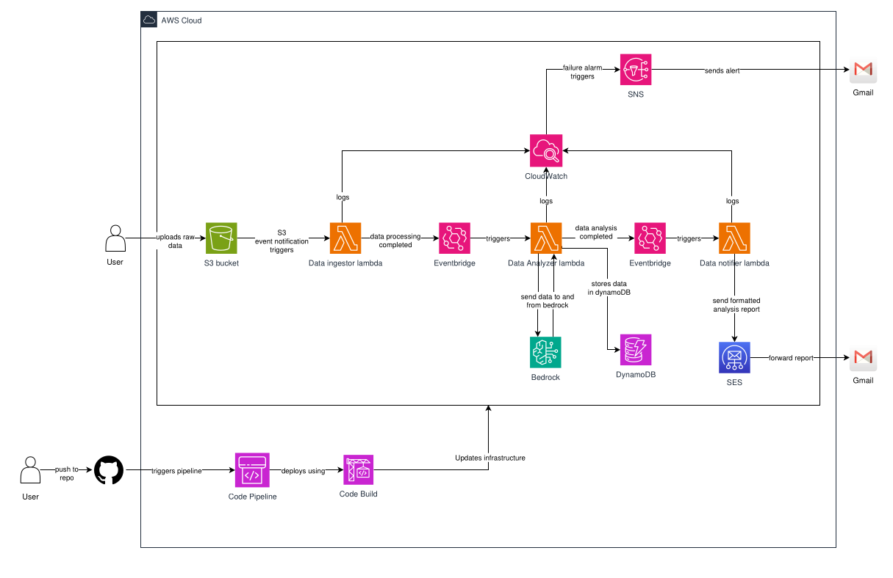

# Serverless Architecture: Data Processing and Analysis

## [Serveless Architecture Github Repo Link](https://github.com/shrijanabudhathoki/Serverless-Architecture) 
## [CICD Github Repo Link](https://github.com/shrijanabudhathoki/CICD)

## High Level Architecture Diagram


## Introduction:

### Serverless Architecture:
Serverless Architecture is a way to build and run applications and services without having to manage infrastructure. The application still runs on a server, but all server management is done by cloud providers. We no longer have to provision, scale, and maintain servers to run your applications, databases, and storage systems.


### Why use Serverless Architecture ?
By using a serverless architecture, your developers can focus on their core product instead of worrying about managing and operating servers or runtimes, either in the cloud or on-premises. This reduced overhead lets developers reclaim time and energy that can be spent on developing great products which scale and that are reliable.


### Data Processing using Serverless Architecture:
This project implements a data processing pipeline on AWS that demonstrates practices including Infrastructure as Code (IaC), security, monitoring, and CI/CD automation.

### Key Features:
1. **Serverless:** AWS managed application
2. **Automation:** CI/CD using CodePipeline and CodeBuild
3. **Infrastructure as Code:** IaC using Terraform
4. **AI-Powered:** Use of LLM for data analysis via Amazon Bedrock
5. **Logging and Monitoring:** Cloudwatch metrics and alerts

### Basic Flow:
1. **Ingestion:** Data is ingested into S3 bucket.
2. **Processing:** Raw data from S3 bucket is cleaned, validated and split into processed and rejected folders.
3. **Orchestration:** The workflow is coordinated using Eventbridge.
4. **Analysis:** Amazon Bedrock perform analysis in processed data.
5. **Storage:** The analyzed data is stored on DynamoDB.
6. **Notification:** The data from DynamoDB is sent through SES emails.
7. **Monitoring:** CloudWatch captures metrics, logs and triggers alarms.

### Prerequisites
- AWS CLI installation
- Configure with credentials
    ```
    aws configure
    ```
- Install required dependencies: python, boto, terraform
- Valid SES email addresses

### Step-by-step Guide
- Clone a reposiory
```
git clone https://github.com/shrijanabudhathoki/Serverless-Architecture.git
cd Serverless Architecture
```
- Configure AWS provider
```
aws configure
```
- Initialize Terraform
```
cd terraform
terraform init
terraform plan
terraform apply
```
- Check your email for SES verification and click the verification link to enable email sending.
- Upload sample data to s3 bucket to test the pipeline
```
aws s3 cp sample_data.csv s3://health-data-bucket-shrijana/raw/
```
- Upload same file twice to check for idempotency.

### CodePipeline and CodeBuild
- To create codepipeline and codebuild, clone a repository:
```
git clone https://github.com/shrijanabudhathoki/CICD.git
cd cicd
```
- Terraform init
```
terraform init
terraform plan
terraform apply
```
- Navigate to connections in aws console and update the connection from `pending` to `available`
- The required aws serverless architecture resources are provisioned when we push code changes to github repository.
- Any changes to github repository triggers code pipeline which automatically deploys the resources required for serverless data processing pipeline.


### Components details
#### Data ingestor lambda function:
- Data ingestor lambda function is s3 based data ingestion pipeline that ingests CSV health data, validates them and sends processed results to S3 bucket and Eventbridge.
- Lambda is triggered when we upload csv file to s3 bucket in raw/ folder.
- The lambda then validates the input against required fields and acceptable ranges.
- The idempotency is enforced using file version and SHA256 hash markers.
- Valid data are sent to processed/ and invalid data are sent to rejected/
- The lambda sends success or failure event to Eventbridge for orchestration of next step.

#### Data analyzer lambda function:
- Data analyzer lambda function analyzes processed data, detect anomalies, generate insights, recommendations and summary based on that data using LLM via Bedrock and saves the result for downstream process.
- It fetches the processed data from S3 bucket and flags row with abnormal metrics.
- It then sends prompt to Bedrock LLM to generate insights, recommendations, and executive summary.
- It saves the analysis result in DynamoDB and s3.
- It notifies downstream process using Eventbridge after the analysis is complete.

#### Data notifier lambda function:
- This Lambda function is a reporting and notification service for your health monitoring system.
- It fetches recent health analysis results from DynamoDB.
- It then aggregates data processing statistics from S3 manifest files.
- It extracts insights, recommendations, and summaries from the analysis.
- It generates a detailed email report (text + HTML) with statistics, anomalies, insights, and recommendations.
- It sends the email via Amazon SES.

### Role of Eventbridge:
Eventbridge orchestrates the workflow. In a pipeline, after one Lambda finishes its task (e.g., data-ingestor or data-analyzer), it sends an event to EventBridge. EventBridge then triggers downstream Lambdas (e.g., notifier) based on the event type or content. The Lambda sends an EventBridge event with details like status: success or status: failed. EventBridge routes these events to the appropriate Lambda (or another consumer). This allows the system to react differently to success vs failure.

### Security Measures:
Each lambda has minimal required permissions following principle of least privilege. For eg. notifier lambda is only allowed to get dynamodb data, create logs and get s3 bucket data. S3 bucket are encrypted using server side encryption which ensures data security. The lifecycle policy in S3 bucket ensures the data is retained for some amount of time.

### Error Handling & Retry Strategies
- Lambda functions log structured JSON messages for success and error events. For example:
```
{
    "ts": "2025-09-18T05:08:35.757421Z",
    "level": "INFO",
    "message": "email_data_prepared",
    "scope": "Current file only",
    "event_type": "eventbridge",
    "total_input_rows": 1000,
    "total_valid_rows": 850,
    "total_rejected_rows": 150,
    "total_analyzed_rows": 850,
    "total_anomalies": 402,
    "insights_count": 5,
    "recommendations_count": 5,
    "anomaly_types": 15
}
```
- Idempotency marker prevents re-analysis; Bedrock or DynamoDB errors logged.
- Retry mechanism for sending email.
- Metrics alarm are used for alert through email in case of lambda failures.

### CICD Pipeline
- CodeBuild and CodePipeline is used for CICD
- CI step fmt, init and validate terraform. It also performs validation testing.
- CD step apply the terraform.

### Github Backsync
We have three branch: main, dev, uat. When we push changes to uat branch, dev is out of sync. Backsync creates pr to dev to sync uat and dev branch.

### Cost Analysis of Bedrock Model
- The model used  for LLM analysis is nova-lite the price of which is $0.00006 per 1000 input tokens.
```
{
    "ts": "2025-09-18T08:06:33.814262Z",
    "level": "INFO",
    "message": "bedrock_usage",
    "prompt_tokens": 2299,
    "completion_tokens": 363,
    "total_tokens": 2662,
    "estimated_cost_usd": 0.00015972
}
```


### Code Pipeline


### Git Backsync


### DynamoDB populated with data


### S3 bucket with raw/, processed/ and rejected/ data


### Alarm firing on failure


### Mail with analysis summary


